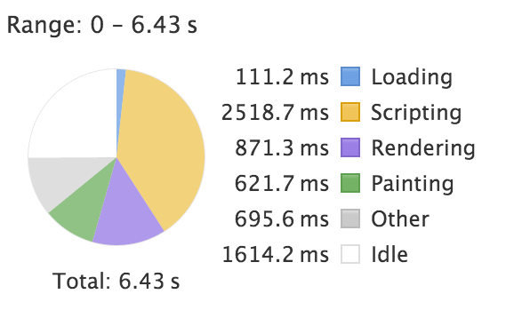
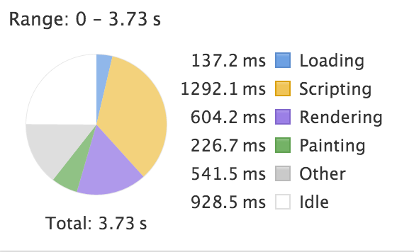
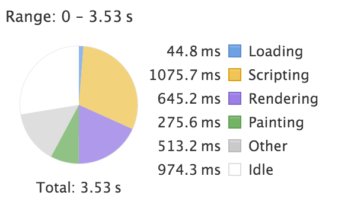

# Bundlin  
The beauty of the web bundled

## Intro  
This project is an assignment from CMD Amsterdam - Everything Web. The goal is to improve the existing site http://bundlin.com.  
All my results have been documented in the Readme here.  

## Initial  
First i checked the initial performance of the site. All testing has been done on a 5GH wifi network.  
The first perfomance check took quite a while.

  
  
As seen, this whole page is done and loaded after **6.43 seconds**  
This seems like a lot of time.  

## Improvements  
So I went on with checking what could be done better. One of the bottlenecks was the 'Featured Entries' feed, which was completely loaded without being in the view.  
Another improvement was the *Above the fold CSS*. This improves the first render of the site.

### Featured entries  
The Featured Entries feed is loaded in at the 'intro.html' page. There is a `ng-repeat` loop which loads all the Featured Items. `ng-repeat` is very heavy on performance, so I modified it with a `limitTo` so not all the items are being loaded.
The limit has been set to 4. The button on the right has a new function which increases the limit number by 4 everytime it is clicked. 
  
Here below the result:
```
// Added bundlelimit
    ...
            scope.bundleLimit = 4;

            scope.scrollRight = function scrollRight(e){
                scrollElement.animate({scrollLeft: '+=' + (scrollDistance * 0.8)}, 500, $.bez([0.74, 0.14, 0.28, 0.9]));
                scope.bundleLimit += 4;
            };
```  
The performance has been improved significantly  
  

*An improvement by 2.7 seconds*  

### Above the Fold CSS  
The CSS is being loaded in from the `<head>` tag. This causes renderblocking. On a slow connection, it can take a while before the whole CSS has been loaded. Therefor it is recommended to use *Above the fold CSS*. This way, the most critical css is rendered without fetching the main CSS file.  

I've fetched the critical CSS with grunt-critical-css. The critical CSS is collected from the rendered pages in the index.html page. The classes from those pages are cross-referenced with the main CSS file and the results are copied to a new index.html file with all the critical CSS in the `<head>` tag.  

  

Although the performance has not been improved, a more essential part is added. As you can see, the rendering time is slightly higher compared with the last result, though the user' page will shown faster.  

### Service Worker  
In the last stage I have added a Service Worker which will cache the HTML, CSS and Javascript. This way the site is able to run offline after it has been cached. A multitude of files can be stored there for later use.  
The code is here below:  
``` 
this.addEventListener('install', event => {
  event.waitUntil(
    caches.open('bundlin-serviceworker').then(cache => {
      return cache.addAll([
        './index.html',
        './css/app.css',
        './css/vendor.css',
        './js/app.js',
        './js/vendor.js',
        './images/*.jpg',
        './images/*.png'
      ]);
    })
  );
});
```

## Conclusion 

Bundlin is already been built with thought and precision, but there is still some things left to improve. As seen in the document above; the data that is being fetched is downloaded as a whole and rendered with `ng-repeat`. This can be heavy for the browser and will take the page longer to load. 

**Recommendation:** Make sure that only the data that is essential and available in the viewport is rendered. The rest of the data can be fetched through, for example, lazy loading.  

Above the fold CSS is a very important element that has to be considered. Though it is hard to figure out what the critical CSS exactly is with Angular's constant view changes. In this case, I've taken the critical CSS from the landing page which is the doorstep to the rest of the page and therefor the most essential page.  

**Recommendation:** Above the fold CSS is important enough to consider with a web application that is this heavy and robust. Do some research in what the user will be seeing at first sight and add the CSS into the `<head>` tag. This way the page will not be fully loaded in the first view seconds, but the user will be able to see all the contents without having to wait too long.


